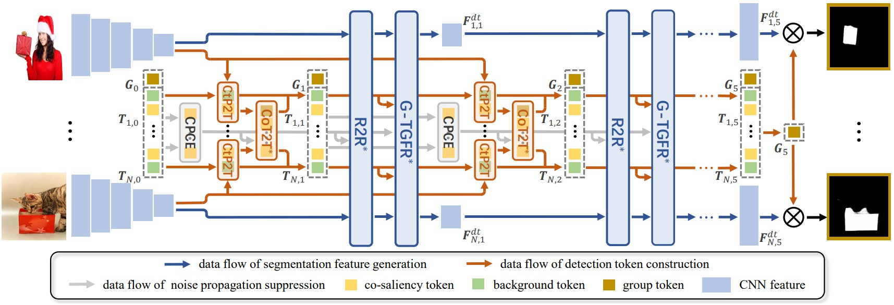

# Advanced-DMT
Code release for the paper "Advanced Discriminative Co-Saliency and Background Mining Transformer for Co-Salient Object Detection" by Long Li, Huichao Xie, Nian Liu, Dingwen Zhang, Rao Muhammad Anwer, Hisham Cholakkal, and Junwei Han.



## Abstract
Most existing CoSOD models focus solely on extracting co-saliency cues while neglecting explicit exploration of background regions, potentially leading to difficulties in handling interference from complex background areas. To address this, this
paper proposes a Discriminative co-saliency and background Mining Transformer framework (DMT) to explicitly mine both co-saliency and background information and effectively model their discriminability. DMT first learns two types of tokens by disjointly extracting co-saliency and background information from segmentation features, then performs discriminability within the segmentation features guided by these well-learned tokens. In the first phase, we propose economic multi-grained correlation modules for efficient detection information extraction, including Region-to-Region (R2R), Contrast-induced Pixel-to-Token (CtP2T), and Co-saliency Token-to-Token (CoT2T) correlation modules. In the subsequent phase, we introduce Token-Guided Feature Refinement (TGFR) modules to enhance discriminability within the segmentation features. To further enhance the discriminative modeling and practicality of DMT, we first upgrade the original TGFR’s intra-image modeling approach to an intra-group one, thus proposing Group TGFR (G-TGFR), which is more suitable for the co-saliency task. Subsequently, we designed a Noise Propagation Suppression (NPS) mechanism to apply our model to a more practical open-world scenario, ultimately presenting our extended version, i.e. DMT+O. Extensive experimental results on both conventional CoSOD and open-world CoSOD benchmark datasets demonstrate the effectiveness of our proposed model.

## Environment Configuration
- Linux with Python ≥ 3.6
- PyTorch ≥ 1.7 and [torchvision](https://github.com/pytorch/vision/) that matches the PyTorch installation.
  Install them together at [pytorch.org](https://pytorch.org) to make sure of this. Note, please check
  PyTorch version matches that is required by Detectron2.
- Detectron2: follow [Detectron2 installation instructions](https://detectron2.readthedocs.io/tutorials/install.html).
- OpenCV is optional but needed by demo and visualization
- `pip install -r requirements.txt`

## Data Preparation
Download the dataset from [Baidu Driver](https://pan.baidu.com/s/192MnRSgXSDXb0l7mJZ18ng) (cxx2) and unzip them to './dataset'. Then the structure of the './dataset' folder will show as following:
````
-- dataset
   |-- train_data
   |   |-- | CoCo9k
   |   |-- | DUTS_class
   |   |-- | DUTS_class_syn
   |   |-- |-- | img_png_seamless_cloning_add_naive
   |   |-- |-- | img_png_seamless_cloning_add_naive_reverse_2
   |-- test_data
   |   |-- | CoCA
   |   |-- | CoSal2015
   |   |-- | CoSOD3k
````

## Training model
1. Download the pretrained VGG model from [Baidu Driver](https://pan.baidu.com/s/173-1VToeumXZy90cRw-Yqw)(sqd5) and put it into `./checkpoints` folder.
2. Run `python train.py`. 
3. The trained models with satisfactory performance will be saved in `./checkpoints/CONDA/`.

## Testing model
1. Download our trained model from [DUTS+CoCo9k](https://pan.baidu.com/s/1YrSAz6MHwrkVmeIyiNONKQ?pwd=cqqn) (cqqn) or [DUTS+CoCoSeg](https://pan.baidu.com/s/1sGaxIvQP8gTNv42eD4XxSQ?pwd=fdgd) (fdgd) or [DUTS](https://pan.baidu.com/s/1HFLh-aNbWu6robjCGHDGog?pwd=csdc) (csdc) or [CoCo9k](https://pan.baidu.com/s/1aKHi9RhH8qqPCrtkO9Petg?pwd=s66e) (s66e) and put them into `./checkpoint` folder.
3. Run `python test.py`.
4. The prediction images will be saved in `./Prediction`. 
5. Run `python ./evaluation/eval_from_imgs.py` to evaluate the predicted results on three datasets and the evaluation scores will be written in `./evaluation/result`.

## Result
The prediction results for CoCA, CoSal2015, CoSOD3k, OWCoCA, OWCoSal, OWCoSOD can be download from [prediction](https://pan.baidu.com/s/1lxaxWPNAwha5nIEdfrGooQ?pwd=skmb) (skmb).
### Conventional CoSOD


